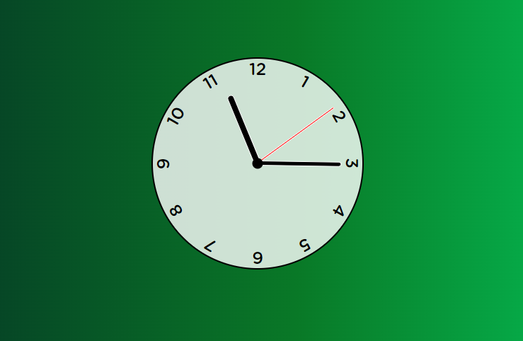

# ⏰ Digital Clock

A simple digital clock built with **HTML**, **CSS**, and **JavaScript**, following the tutorial by [Web Dev Simplified](https://www.youtube.com/@WebDevSimplified). The project uses the **Gotham Rounded** font, included in the project folder under `fonts`.


## 🛠️ Technologies Used

- **HTML**: Structure of the page.
- **CSS**: Styling and design of the clock.
- **JavaScript**: Logic for real-time clock updates.

## 🔤 Font

The font used for the clock's design is **Gotham Rounded**, and it is included in the project under the `fonts` folder. Make sure the font is correctly imported in the CSS file.

## 📋 Usage

1. Clone the repository:

   ```bash
   git clone https://github.com/ViorelsS/JS_Clock.git
   ```

2. Open the `index.html` file in your browser to see the clock in action.

## 🎥 Tutorial Reference

- YouTube Tutorial: [Web Dev Simplified](https://www.youtube.com/watch?v=Ki0XXrlKlHY&t=22s)

## 🌐 Deployment

This project is deployed using **GitHub Pages** and can be accessed at [this link](https://viorelss.github.io/JS_Clock/).

## 🤝 Contributing

Contributions are welcome! If you'd like to improve the project, feel free to fork the repository, open issues, or submit pull requests. All contributions, big or small, are greatly appreciated!

1. Fork the project.
2. Create a new branch (`git checkout -b feature/YourFeature`).
3. Commit your changes (`git commit -m 'Add new feature'`).
4. Push to the branch (`git push origin feature/YourFeature`).
5. Open a pull request.

---

### 🖼️ Project Screenshot


